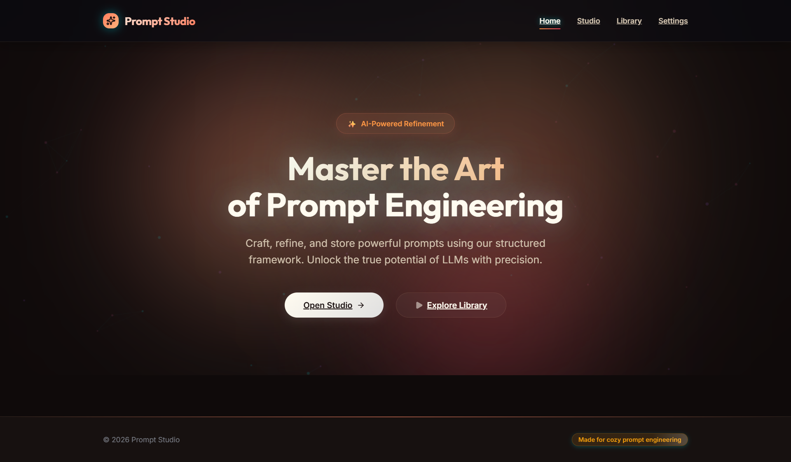
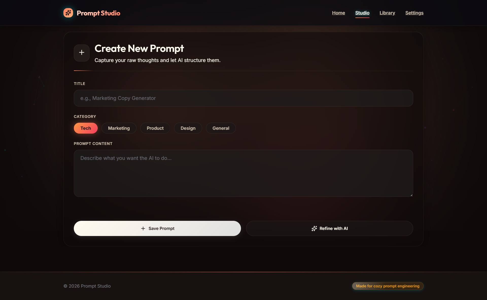
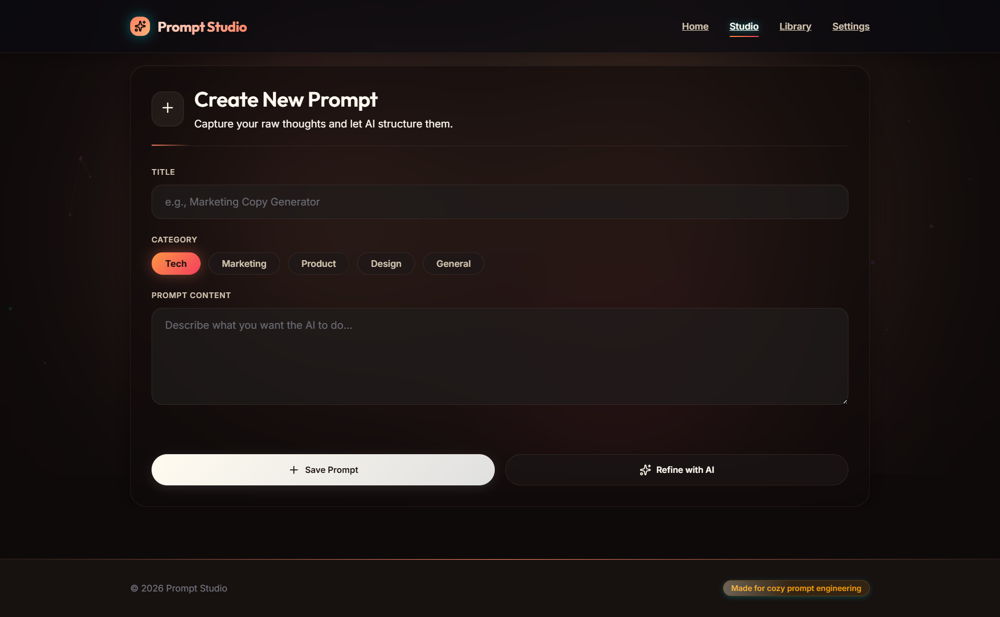

# Prompt App

Prompt App is a full-stack prompt engineering workspace.

## Visual Preview

Use this section to add high-level screenshots for quick context.

### Main Screens Overview





_Placeholder: Add one screenshot per core page (Studio, Library, Settings)._ 

It helps you:
- Create and organize prompts by category.
- Refine rough prompt drafts into a structured format using AI.
- Save, edit, delete, search, filter, favorite, and copy prompts.
- Manage client-side settings like theme and API base override.

The project has two parts:
- `client/`: React + TypeScript + Vite frontend.
- `server/`: Express API with Supabase persistence and OpenAI-based refinement.

## What the app does

### Core user workflow
1. Go to **Studio** and write a prompt draft.
2. Click **Refine with AI** to generate a structured prompt (Role, Task, Requirements, Instructions).
3. Apply refined output back into the editor if desired.
4. Save the prompt to the library.
5. Browse and manage prompts in **Library** (search, filter, favorite, copy, edit, delete).
6. Use **Settings** to switch theme and override API base URL.

### Main features
- Prompt CRUD (create, read, update, delete).
- AI prompt refinement using OpenAI Chat Completions.
- Category-based organization.
- Favorites stored in browser localStorage.
- Text search by title/content.
- Clipboard copy support.
- Light/dark theme with persisted preference.
- Toast notifications for user feedback.

## Tech stack

### Frontend
- React 19
- TypeScript
- Vite
- React Router
- Framer Motion
- Lucide React icons

### Backend
- Node.js + Express
- Supabase JS client
- OpenAI Node SDK
- dotenv + CORS

## Architecture overview

### Architecture Diagram


_Placeholder: Add a diagram showing Client -> Server -> Supabase/OpenAI flow._

### Frontend architecture (`client/src`)
- `pages/`
  - `Home`: Landing and navigation entry.
  - `Studio`: Prompt editor + AI refinement + save/update.
  - `Library`: Prompt listing, filters, search, favorites, copy, edit, delete.
  - `Settings`: Theme toggle and API base override.
- `services/`
  - `promptService`: Calls `/api/prompts` endpoints.
  - `refineService`: Calls `/api/refine` endpoint.
- `hooks/`
  - `usePrompts`: Fetch and delete prompt state management.
  - `useFavorites`: localStorage-backed favorites.
- `providers/`
  - `theme`: Theme context provider and hook.
  - `toast`: Toast context provider and hook.
- `lib/`
  - `api.ts`: Resolves API base URL from localStorage override or env.
  - `http.ts`: Shared JSON request helper and error extraction.
- `utils/`
  - `filters.ts`: Library filtering logic.
  - `clipboard.ts`: Clipboard helper.

### Backend architecture (`server`)
- `index.js`: App bootstrap, middleware setup, route mounting, service initialization.
- `config/`
  - `config.js`: Environment variable mapping.
  - `database.js`: Supabase client init/access.
  - `openai.js`: OpenAI client init/access.
- `routes/`
  - `index.js`: `/health`, optional `/debug` in development, and route mounting.
  - `promptRoutes.js`: Prompt CRUD routes.
  - `refineRoutes.js`: Prompt refinement route.
- `controllers/`
  - `promptController.js`: Supabase-backed CRUD handlers.
  - `refineController.js`: OpenAI refinement handler.
- `middleware/errorHandler.js`: Global error response formatter.

## API reference

### Health
- `GET /api/health`
- Response:
  ```json
  { "ok": true }
  ```

### Prompt endpoints

#### List prompts
- `GET /api/prompts`
- Response:
  ```json
  {
    "prompts": [
      {
        "id": "uuid",
        "title": "string",
        "content": "string",
        "category": "string",
        "created_at": "timestamp"
      }
    ]
  }
  ```

#### Create prompt
- `POST /api/prompts`
- Body:
  ```json
  {
    "title": "string",
    "content": "string",
    "category": "string"
  }
  ```
- Success: `201`

#### Update prompt
- `PUT /api/prompts/:id`
- Body:
  ```json
  {
    "title": "string",
    "content": "string",
    "category": "string"
  }
  ```

#### Delete prompt
- `DELETE /api/prompts/:id`
- Success: `204`

### Refinement endpoint

#### Refine a prompt draft
- `POST /api/refine`
- Body:
  ```json
  {
    "prompt": "string",
    "category": "string"
  }
  ```
- Response:
  ```json
  {
    "refined": "markdown string"
  }
  ```

## Environment variables

Create `.env` files in both `server/` and `client/`.

### Server (`server/.env`)
- `PORT`: API server port (default: `4000`).
- `SUPABASE_URL`: Supabase project URL.
- `SUPABASE_SERVICE_ROLE_KEY`: Supabase service role key.
- `OPENAI_API_KEY`: OpenAI API key.

### Client (`client/.env`)
- `VITE_API_BASE`: API base URL (default fallback is `http://localhost:4000`).

Note: In-app API override can also be set via **Settings** and is saved in localStorage key `api_base_override`.

## Database requirements

The server expects a Supabase table named `prompts` with at least these columns:
- `id` (UUID, primary key)
- `title` (text)
- `content` (text)
- `category` (text)
- `created_at` (timestamp, default now)

Example SQL:

```sql
create table if not exists prompts (
  id uuid primary key default gen_random_uuid(),
  title text not null,
  content text not null,
  category text not null,
  created_at timestamptz not null default now()
);
```

## Local development

### Setup Screenshots (Optional)


_Placeholder: Add terminal screenshots showing successful startup for server and client._

### 1. Install dependencies

```bash
cd server
npm install

cd ../client
npm install
```

### 2. Configure environment variables

- Add values to `server/.env`.
- Add `VITE_API_BASE` to `client/.env`.

### 3. Run backend

```bash
cd server
npm start
```

Server starts at `http://localhost:4000` (or your configured `PORT`).

### 4. Run frontend

```bash
cd client
npm run dev
```

Vite will print the frontend URL (typically `http://localhost:5173`).

## Available scripts

### Client (`client/package.json`)
- `npm run dev`: Start Vite dev server.
- `npm run start`: Alias for Vite dev server.
- `npm run build`: Type-check + production build.
- `npm run lint`: Run ESLint.
- `npm run preview`: Preview production build.

### Server (`server/package.json`)
- `npm start`: Start Express server.

## Error behavior and troubleshooting

### Common backend errors
- `Database not configured`
  - Cause: Supabase env vars missing/invalid.
  - Fix: Set `SUPABASE_URL` and `SUPABASE_SERVICE_ROLE_KEY`.

- `OPENAI_API_KEY not configured or API error`
  - Cause: Missing/invalid key or upstream API issue.
  - Fix: Set valid `OPENAI_API_KEY`, verify quota/billing.

### Helpful endpoint in development
- `GET /api/debug` is available when `NODE_ENV=development`.
- It returns boolean flags indicating whether OpenAI and Supabase are configured.

## Security notes

- Never commit real API keys or service role keys to source control.
- Use environment variable files locally and secret management in production.
- If credentials are ever exposed, rotate them immediately.

## Deployment notes


- Deploy frontend and backend separately.
- Ensure CORS policy on backend allows your frontend origin.
- Provide all required server environment variables in the deployment platform.
- Point frontend `VITE_API_BASE` (or settings override) to the deployed API URL.

## Current behavior constraints

- No authentication/authorization layer is implemented.
- Favorites are client-only (localStorage), not synced to backend.
- Prompt validation is minimal (required fields only).

These are good candidates for future improvements if you plan to scale the app.

## Image Asset Conventions

Recommended image folder structure:

```text
docs/
  images/
    hero/
    screens/
    architecture/
    api/
    setup/
    deployment/
```

